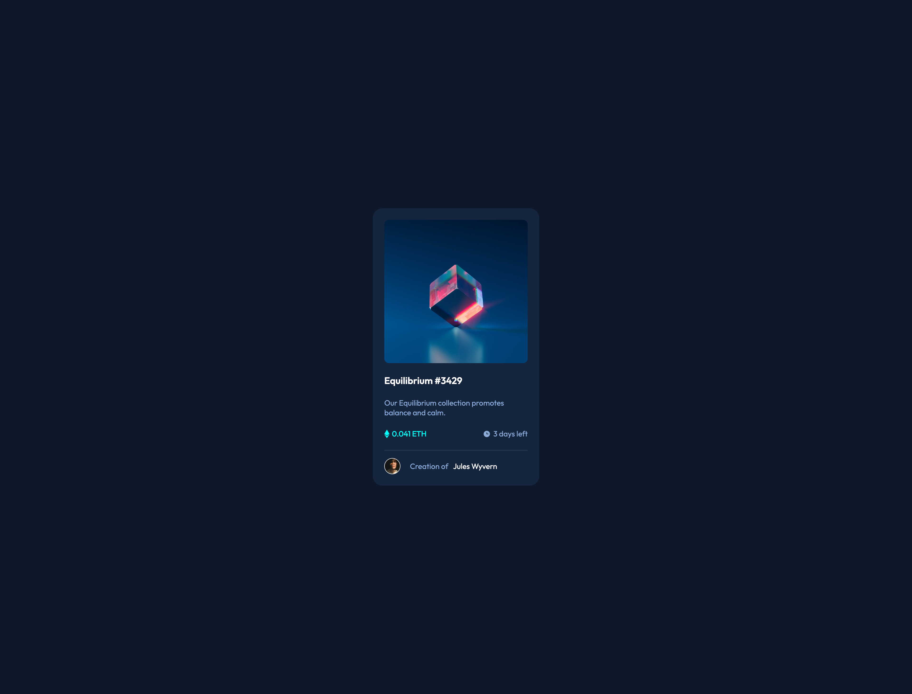

# Frontend Mentor - NFT preview card component solution

This is a solution to the [NFT preview card component challenge on Frontend Mentor](https://www.frontendmentor.io/challenges/nft-preview-card-component-SbdUL_w0U). Frontend Mentor challenges help you improve your coding skills by building realistic projects.

## Table of contents

-   [Overview](#overview)
    -   [The challenge](#the-challenge)
    -   [Screenshot](#screenshot)
    -   [Links](#links)
-   [My process](#my-process)
    -   [Built with](#built-with)
-   [Author](#author)

## Overview

### The challenge

Users should be able to:

-   View the optimal layout depending on their device's screen size
-   See hover states for interactive elements

### Screenshot

### Links

-   [Solution URL](https://github.com/nevenduranec/nft-card-component)
-   [Live Site URL](https://nft-card-component-indol.vercel.app/)

## My process

### Built with

-   Semantic HTML5 markup
-   Flexbox
-   Mobile-first workflow
-   CSS vars
-   PostCSS - [postcss-nested](https://github.com/postcss/postcss-nested), [postcss-pxtorem](https://github.com/cuth/postcss-pxtorem), [autoprefixer](https://github.com/postcss/autoprefixer)
-   Webpack

## Author

-   Website - [Neven Đuranec](https://digitalbits.hr/)
-   Frontend Mentor - [@nevenduranec](https://www.frontendmentor.io/profile/nevenduranec)
-   Twitter - [@nevenduranec](https://www.twitter.com/nevenduranec)
